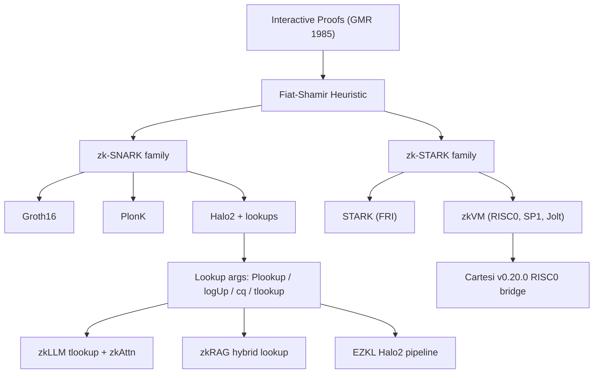
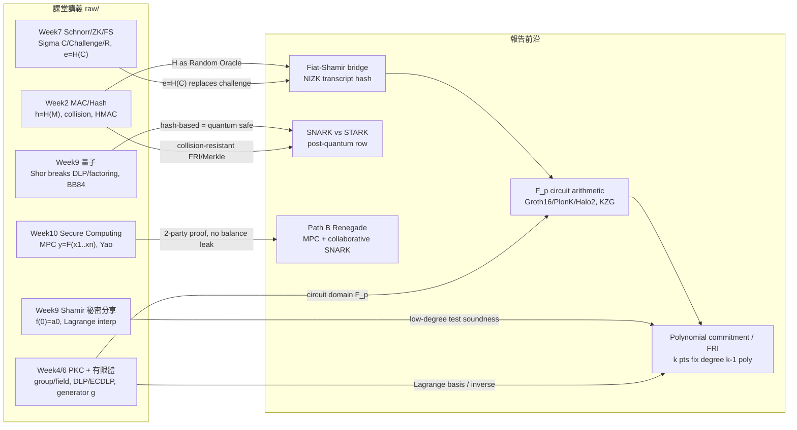
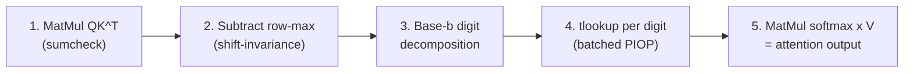
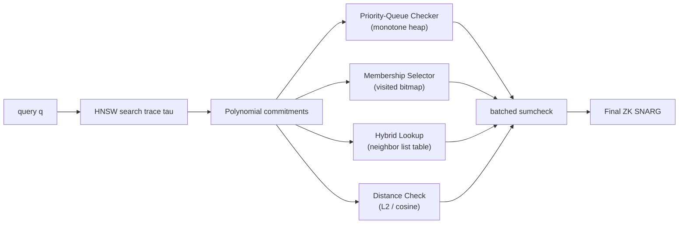
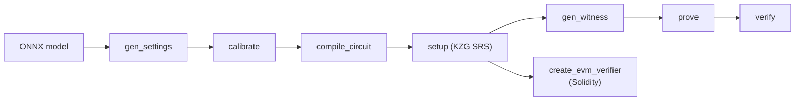
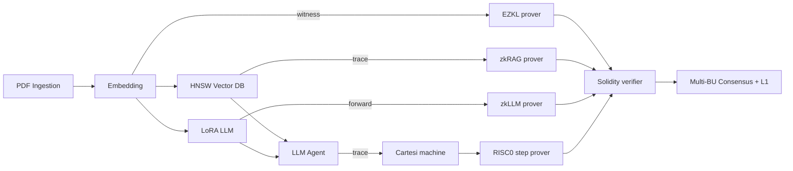

# Verifiable AI Agent on Cartesi
### 從 zkRAG / zkLLM 到 RISC0-Cartesi 的可驗證 LLM 服務

---

## 為什麼要「驗證 LLM Agent」？

- LLM 已進入法律 / 醫療 / 財金等高敏感領域決策
- 「服務方有沒有用宣稱的模型 + 公開承諾的 RAG 文件」目前 = **純信任**
- NYT v. OpenAI、EU AI Act、台灣金管會生成式 AI 治理指引皆觸及
- 密碼學給的答案：每次推論附一份**數學收據**，毫秒級驗證、不揭露權重
- final主軸：把 2024-2026 最前沿 ZKP 成果嵌進既有 DEAAP pipeline

<!-- footer: 'Why verify LLM Agent? ‧ NYT v. OpenAI, EU AI Act' -->
(footer我就是放我筆記中寫的那些論文/文章的出處，大家可以直接讀相關關鍵字比較好對應)

---

## 場景：可驗證的私有 RAG 查詢

- user：律師查公司內部合約 → 提示工程 + RAG retrieval + LLM 生成
- risk：retrieval 偷塞段落、LLM 換成便宜模型、embedding 用了未授權版本
- 三條 ZKP 路徑各自處理 pipeline 的某一層：
  - **EZKL** ← Embedding 層
  - **zkRAG** ← HNSW 向量檢索層
  - **zkLLM** ← LLM forward pass 層
- Cartesi v0.20.0 把所有 proof 結算到同一個 on-chain verifier
- 目的就是建立 LLM 監管時代的密碼學承諾

<!-- footer: 'Motivating scenario ‧ DEAAP private RAG pipeline' -->

---

## ZKP 基礎 ‧ 互動式 → 非互動式 (這段我故意跟老師上的簡單連結)

- **GMR 1985** 定義互動式證明（Interactive Proof, IP）：completeness + soundness + zero-knowledge
- 互動式：prover 與 verifier 來回對話、verifier 用隨機 challenge 卡 prover
- **Fiat-Shamir heuristic**：把 verifier 隨機 challenge 用密碼學雜湊 $H(\cdot)$ 取代
- 結果：互動式 → 非互動式（NIZK），proof 一段就能離線驗證
- 所有現代 SNARK / STARK / zkVM 都站在這個橋上

<!-- footer: 'Vitalik snarks intro ‧ Thaler PAZK ch 1' -->

---

## ZKP 家族樹



---

## 從課堂到前沿



- Week7 `e=H(C)` → Fiat-Shamir / NIZK；Week4 體論 → `F_p` 電路；Week9 Shamir `f(0)=a0` → polynomial commitment / FRI

(這個我就幫大家複習課堂上老師上的跟我們報告之間連結的重點)

---

## SNARK vs STARK：兩條主流路線

|  | zk-SNARK (Groth16/PlonK/Halo2) | zk-STARK (FRI-based) |
|---|---|---|
| Proof size | 數百 B – 數 KB | 數十 KB – 數 MB |
| Verifier cost | $O(\log n)$ pairing/field ops | $O(\log^2 n)$ hash |
| Trusted setup | Universal (PlonK/Halo2) or per-circuit (Groth16) | 完全 transparent |
| 後量子 | 多數 NO（pairing-based） | YES (hash-based) |
| 代表用途 | EVM L2 (zkSync, Scroll), zkLLM | StarkNet, RISC Zero, Cartesi RISC0 |

關鍵：**Halo2 / Plonky2** 是兩條路線的混合體，前者把 lookup 帶到主流

<!-- footer: 'SNARK vs STARK ‧ Vitalik snarks intro' -->

---

## Lookup arguments — 2024 後新主流

- 動機：非算術 op（Softmax、GELU、SwiGLU、range check）在電路中極不友善
- 解法：把 $(x, f(x))$ 合法對化為查表，prover 只證「我查的每一對都在表中」
- 演化路線：
  - **Plookup** (Gabizon-Williamson 2020) — 第一個實用 lookup PIOP
  - **logUp** — 用 log-derivative 改良乘積形式
  - **cq** — caulk / cached quotients，table 預處理
  - **tlookup** (zkLLM) — 張量化版本，整 attention head 一次 batch
- 因此我們藉由這條主線串起 zkLLM / zkRAG / EZKL 三篇核心論文

<!-- footer: 'Lookup args (Plookup)' -->

---

## zkVM 生態速覽

- **RISC Zero**：RISC-V STARK + Groth16 wrapper，可選 200 B proof，Cartesi v0.20.0 採用
- **SP1** (Succinct)：RISC-V STARK，目前 prove 速度業界領先（[Fenbushi 2025 benchmark](https://fenbushi.vc/2025/08/29/benchmarking-zkvms-current-state-and-prospects/)）
- **Jolt** (a16z)：lookup-centric zkVM，理論優雅
- 共同 trade-off：開發體驗極佳（不必改原 code）vs. proof size / time 比客製電路差
- DEAAP 取 **RISC Zero** 因為 Cartesi v0.20.0 原生整合

<!-- footer: 'zkVM landscape ‧ Fenbushi 2025 benchmark' -->

---

## Folding schemes

- 動機：證明一段長 trace（e.g. 100 萬 mcycle）一次性出 proof 太大
- 解法：把多個 instance 透過代數方式「折疊」成一個 instance，遞迴下去
- 代表作：**Nova** (Microsoft 2022) → **SuperNova** → **HyperNova** ([ePrint 2023/573](https://eprint.iacr.org/2023/573))
- 工具：[microsoft/Nova](https://github.com/microsoft/Nova/)、[Sonobe folding lib](https://github.com/privacy-scaling-explorations/sonobe)
- DEAAP 未來可用 folding 把 N 個 Cartesi step proof 合成一個

<!-- footer: 'Folding ‧ Nova / HyperNova' -->

---

## zkLLM — 動機與 tlookup

- 問題：LLM 推論的 Softmax / GELU / SwiGLU 是非算術，傳統 SNARK 不友善
- **tlookup**：張量化的 lookup argument，整 attention head / FFN block 共用一張表
- 數學技巧（Softmax 處理）：
  - Shift-invariance：$\mathrm{softmax}(s_{ij}) = \mathrm{softmax}(s_{ij} - \max_j s_{ij})$
  - Base-$b$ 拆解：$x = \sum_k d_k b^k$，$\exp(x) = \prod_k \exp(d_k b^k)$
  - 每個 digit 查 $O(b)$ 小表 → 總 table size $O(b \log_b M)$
- 結果：13B 參數 LLM proof < 15 min，proof size < 200 KB

<!-- footer: 'zkLLM' -->

---

## zkLLM zkAttn 5-step flow



- Softmax 拆 5 步，每步都 sumcheck-friendly 或 lookup-friendly
- 所有 attention head 共用一張小表 → tlookup 一條 PIOP 批次驗證
- 對應 DEAAP 的 LLM Agent layer 推論證明

<!-- footer: 'zkAttn' -->

---

## zkRAG — 動機

- 2026-04-12 釋出，史上第一個專為 **HNSW** 近似最近鄰檢索設計的 PIOP
- 為什麼 HNSW 難？
  - Priority queue 的 push/pop 在算術電路中極貴
  - Visited bitmap 的 sparse 訪問
  - Multi-level graph 的隨機跳轉
- 通用 zkVM baseline：1M × 128-dim 向量需數小時 prove
- zkRAG：~50s prove，**~1000× 加速**
- 對應 DEAAP 的 Vector DB / Retrieval layer

<!-- footer: 'zkRAG' -->

---

## zkRAG PIOP flow



- 四個 PIOP component 收斂到單一 SNARG，verifier $O(\log T + \log |V|)$

<!-- footer: 'zkRAG' -->

---

## EZKL — ONNX → Halo2 → Solidity verifier



- 把任意 ONNX 自動編譯成 Halo2 電路 + lookup 表
- 非算術 op 全部走 lookup → 與 zkLLM tlookup 同家族
- 這是我們 **Demo A** 的核心工具鏈

<!-- footer: 'EZKL ‧ docs.ezkl.xyz' -->

---

## Benchmark：三條主線效能對照

| Backend | Task | Prove time | Proof size | Verifier |
|---|---|---|---|---|
| zkLLM | LLaMA-13B forward | < 15 min | < 200 KB | < 1 s |
| zkRAG | 1M × 128-dim retrieval | ~ 50 s | ~ MB (FRI) | $O(\log T)$ |
| EZKL | Small ONNX (~1M params) | 數十秒-分鐘 | KB 級 | EVM verifier ~ M gas |
| RISC0 zkVM | 1 mcycle step | ~秒級 | ~100 KB (STARK) / ~200 B (wrapped) | ~200k gas |

- 結論：不同 layer 用不同 backend，**不要用單一 zkVM 暴力證整條 pipeline**

<!-- footer: 'Benchmarks ‧ Fenbushi 2025, zkLLM §5, zkRAG §5' -->

---

## DEAAP

- [romantic-no-rush / DEAAP](https://github.com/iiyyll01lin/romantic-no-rush/tree/202506-rc1)
- 既有 pipeline：
  1. **Document Ingestion** — PDF / OCR
  2. **Embedding Layer** — sentence-transformers MiniLM
  3. **Vector DB** — HNSW 向量索引
  4. **LoRA-tuned LLM** — Agent backbone
  5. **Multi-BU Cartesi Consensus** — optimistic rollup 結算
- 我們不拆掉重做，只「**疊加**」一層密碼學承諾

<!-- footer: 'DEAAP github.com/iiyyll01lin/romantic-no-rush' -->

---

## Cartesi Machine v0.20.0 釋出亮點

- **釋出日期**：2026-04-09，[Release notes](https://github.com/cartesi/machine-emulator/releases/tag/v0.20.0)
- 三個關鍵變更：
  1. `cartesi-risc0-guest-step-prover.bin` — 原生 RISC0 step prover
  2. `cm_collect_mcycle_root_hashes` API — 一次收集 trace state roots
  3. Solidity `IRiscZeroVerifier` 範例 — 直接上 EVM 驗證
- PR #343：[feature/risc0](https://github.com/cartesi/machine-emulator/pull/343)（C++/Rust/Solidity 三層實作）
- 意義：optimistic rollup 多了 **ZK fallback** 通道

<!-- footer: 'Cartesi v0.20.0 ‧ release notes 2026-04-09' -->

---

## RISC0 step prover 工作流（Demo B）

```
1. cartesi-machine ... --store=./snapshot
2. cartesi-machine --load=./snapshot \
     --collect-mcycle-root-hashes=./roots.bin
3. ./cartesi-risc0-guest-step-prover \
     --pre-state=roots[t].bin --post-state=roots[t+1].bin \
     --output=step_proof.bin
4. cast call $VERIFIER "verify(...)" $proof $PRE $POST
```

- Step 3 把單一 mcycle 的狀態轉換轉成 RISC0 STARK proof
- Step 4 在 Ethereum L1 / L2 用 Solidity verifier 驗證

<!-- footer: 'Demo B workflow ‧ Cartesi release notes' -->

---

## DEAAP × RISC0 × Cartesi 目標架構



---

## Hybrid rollup：optimistic + ZK fallback

- **原本**：optimistic 結算 → 7 天 fraud proof challenge window
- **v0.20.0 之後**：
  - 一般情況仍 optimistic（便宜、低 prover cost）
  - 出現爭議或高敏感結算 → 提交方上 RISC0 step proof，秒級驗
- 對 DEAAP：
  - Multi-BU consensus 任一 BU 對 LLM agent 結果有異議 → 走 ZK fallback
  - 信任預算從「等一週」改成「等密碼學驗證」
- 業界 trend：StarkWare、Eclipse、Espresso 都在做這條路線

<!-- footer: 'Hybrid rollup ‧ Cartesi v0.20.0 design rationale' -->

---

## PoC 設計 (我覺得可以錄影backup demo)

- **Demo A — Verifiable Embedding (EZKL)**：對應 DEAAP Embedding Layer
- **Demo B — Cartesi Step Proof (RISC0)**：對應 DEAAP Multi-BU Cartesi Consensus
- 實作證明「Halo2 SNARK」與「STARK zkVM」
- 工具鏈：Docker（Cartesi 官方 + RISC Zero 官方混搭）+ EZKL CLI

---

## Demo A — EZKL Verifiable Embedding

- 對象：384→64 linear projection（模擬 sentence-transformer 單層）；ONNX opset 11 → EZKL Halo2 → KZG SRS k=15
- 流程：`gen_settings → calibrate → compile → setup → gen_witness → prove → verify`（4 stages）
- 實測 wall time：build 147 s / run **24 s**（Docker 29.4, x86_64, 11 GB free RAM）
- output artefacts：

| File | du -h | 用途 |
|---|---|---|
| `settings.json` | 4K | EZKL circuit 設定 (k=15) |
| `input.json` | 12K | 384 維 witness input |
| `vk.key` | 68K | Verifying key（鏈上 verifier 唯一需要） |
| `witness.json` | 68K | gen_witness 中介產物 |
| `proof.json` | 84K | **Halo2 proof 本體** |
| `model.onnx` | 100K | 384→64 linear weights |
| `model.compiled` | 784K | EZKL compile 後的 Halo2 circuit |

- Stage 04 verifier：

```text
[04] verify proof=/work/artefacts/proof.json, vk=/work/artefacts/vk.key
PROOF VERIFIED
```

- 串到 zkRAG ：「embedding step 證了 → retrieval step 可繼續證」

<!-- footer: 'Demo A ‧ poc/ezkl-embedding-demo/' -->

---

## Demo B — RISC0 + Cartesi Step Proof (hybrid)

- **Stages 00, 01 — REAL crypto** ‧ **Stages 02-05 — MOCK (pipeline shape only)**
  - 00: `cargo risczero new multiply` → 真實 STARK prove + verify（`risc0-hello-world.receipt.bin` 208 KB）
  - 01: 從 v0.20.0 release 真實 fetch `cartesi-risc0-guest-step-prover.bin` (868 KB)
  - 02: best-effort（`apt install machine-emulator_*.deb` + cross-compile counter guest，缺 RV64 linker 走 stub）
  - 03-05: mock —— shape 對齊 release（5 dense uarch hashes、`MOCKPRF`-magic 264 B proof、`pre↔post` 一致性 check）
- 實測 wall time：build 700 s / run **74 s** (`--mock-mode`)；hybrid design
- 現在也可在 dev-mode (~69 s, 1.14 GiB peak) 跑真 Cartesi state-transition + dev-mode RISC0 receipt — `--dev-mode` 把 02-05 升級到真 cartesi-machine snapshot / `--log-step` 二進位log / `RISC0_DEV_MODE=1` r0vm dev receipt / `cargo risczero verify`）
- output artefacts：

| File | du -h | 真/假 |
|---|---|---|
| `risc0-hello-world.log` | 4K | REAL — stage 00 cargo run stdout |
| `step.log.json` | 4K | MOCK — `cm_collect_uarch_cycle_root_hashes` skeleton |
| `step.post.hash` | 4K | MOCK — post-state root |
| `step.pre.hash` | 4K | MOCK — pre-state root |
| `step.proof.bin` | 4K | MOCK — `MOCKPRF\0` magic + 256 random bytes |
| `step.public.json` | 4K | MOCK — `{mode, image_id, pre_root, post_root, mcycle}` |
| `risc0-hello-world.receipt.bin` | 208K | REAL — bincode-serialised RISC0 STARK receipt |

```text
[00] receipt verified successfully against MULTIPLY_ID (real STARK seal)
...
[MOCK] step.proof.bin verified: pre_root↔post_root match, mcycle_count=100
```

- 串到 hybrid rollup：「dispute 從一週縮到秒級」；32 GB+ workstation 可 `--full` 切回 02-05 真實路徑

<!-- footer: 'Demo B ‧ poc/risc0-cartesi-step-demo/' -->

---

## Demo Takeaways

- EZKL `calibrate` 對 input range 敏感 → 必須拿 representative 樣本
- RISC0 toolchain 首次編譯 ~30 mins
- ONNX opset 17 比 18 / 19 在 EZKL 支援度佳
- 兩條 backend 共用同一個 Solidity verifier 入口 → dispatcher 模式可擴展
- 如果時間夠：把 EZKL proof 餵進 Cartesi machine 內，做「proof of proof」鏈

---

## 未來延伸方向 — DeFi 隱私撮合

-  [`cartesi-stock-exchanger`](https://github.com/iiyyll01lin/romantic-no-rush/tree/202506-rc1) 已做撮合
- 延伸把 ZK 用在 **dark pool / private order matching**：
  - [Renegade.fi whitepaper](https://renegade.fi/whitepaper.pdf) — MPC + ZK 撮合
  - [Singularity DarkSwap](https://singularityzk.gitbook.io/singularity/the-singularity-solution/protocol-overview/darkpool-architecture-and-usecase)
  - [Darklake](https://github.com/darklakefi)
- 「匿名身分認證 + DeFi 隱私」

<!-- footer: 'Renegade / Singularity / Darklake' -->

---

## 未來延伸方向 — Folding / Recursion + RAG audit

- **Folding**：[HyperNova ePrint 2023/573](https://eprint.iacr.org/2023/573)、[Nova](https://github.com/microsoft/Nova/)、[Sonobe](https://github.com/privacy-scaling-explorations/sonobe)
  - 把多個 Cartesi step proof 折疊成單一 proof，proof cost amortize
- **RAG audit**：
  - [LatentAudit](https://arxiv.org/html/2604.05358) — Groth16 驗證 RAG faithfulness
  - [Proof-Carrying Answers](https://github.com/HimJoe/proof-carrying-answers) — Merkle authenticated vector index
- 還有哪些問題？zkLLM 規模 → 100B+、RAG 端到端 proof composition、ZK + TEE 混合

<!-- footer: 'Folding + RAG audit' -->

---

## Limitations & Outlook

- **規模天花板**：13B LLM 還是研究級，DeepSeek / GPT-4 以上規模未公開可行解
- **Prover hardware**：當前主要靠單機 A100；分散式 prover 是下一個研究熱點
- **Standard 缺口**：proof 格式、verifier interface、composition 規範未統一
- **法規對齊**：EU AI Act 合規 audit log 與 ZK proof 串接未見成熟

---

## Q&A

- 可以準備被問的：
  - 為什麼不用單一 zkVM 暴力證 LLM？
  - tlookup vs Plookup 的差別？
  - Cartesi v0.20.0 與 OP Stack / Arbitrum Stylus 的競爭合作？
  - ...(可以補)
